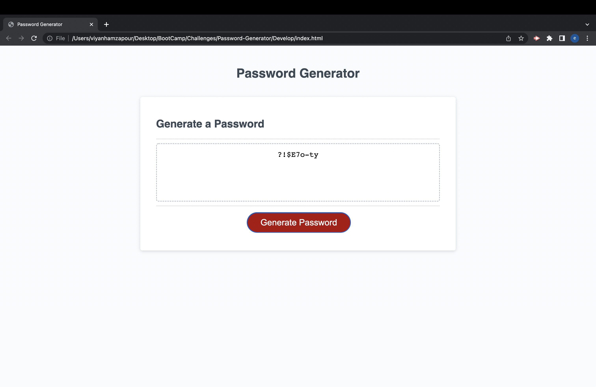

# Password-Generator 

## Table of Contents
* General Info
* Technologies Used
* Screenshot
* Project Status
* Link to Deployed Application

## General Information
This application features HTML, CSS, and JavaScript to generate a password. The user will be prompted with messages to select between 8-128 characters, lowercase or uppercase letters, numbers, and special characters to include in their password. If they do not select one of the characteristics, they will be alerted with a message to choose at least one. 

## Technologies Used
* HTML
* CSS
* Javascript

## Screenshot

## Project Status
Project is: completed

## Link to Deployed Application
https://ehamzapour.github.io/Password-Generator/